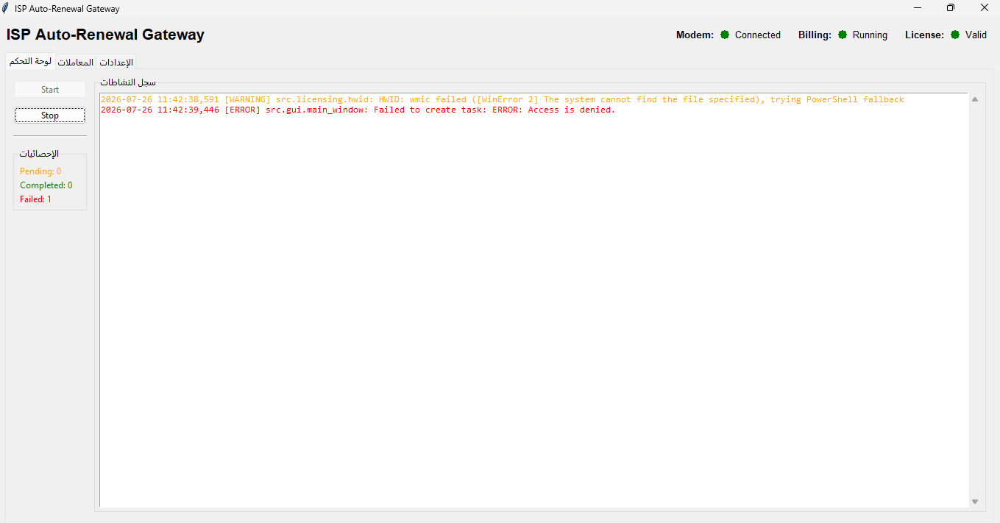
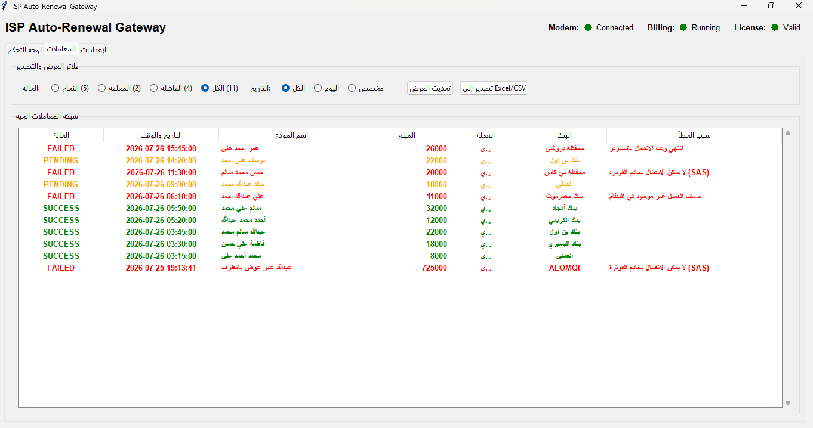
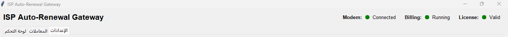
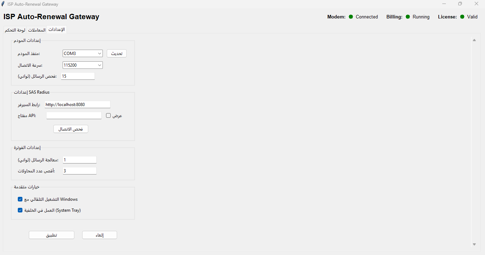

# نظام الأتمتة المدمجة لمزودي الإنترنت
## ISP Auto-Renewal Gateway

**الشركة المنشئة:** Alhassan AI Startup  
**الموقع:** اليمن - حضرموت - المكلا  
**البريد الإلكتروني:** alhassanaistartup@gmail.com

---

## 🎯 ما هو النظام؟

نظام وسيط (Middleware) محلي بالكامل يقرأ إشعارات الإيداع البنكي من مودم GSM، يحللها، ويتكامل مع نظام SAS Radius لأتمتة تجديد اشتراكات الإنترنت فورياً - على مدار الساعة دون تدخل بشري.

---

## 🏦 البنوك والمحافظ المدعومة

### البنوك اليمنية
- بنك بن دول
- بنك حضرموت
- بنك أمجاد
- بنك البسيري
- بنك الكريمي
- جميع البنوك اليمنية الأخرى

### المحافظ الإلكترونية
- بي كاش
- شلن
- قروشي
- جميع المحافظ الإلكترونية

---

## 💡 المشكلة التي يحلها

**المشكلة:** تجديد الاشتراكات يدوياً يسبب:
- تأخير في الخدمة
- أخطاء بشرية
- ضياع الوقت
- صعوبة التتبع

**الحل:** النظام يعمل تلقائياً 24/7، يقرأ الرسائل، يطابق المستخدمين، يودع المبلغ، ويجدد الاشتراك فوراً.

---

## ✨ المميزات الرئيسية

### 🚀 الأتمتة الكاملة
- يعمل على مدار الساعة دون تدخل بشري
- معالجة فورية للرسائل (أقل من 5 ثوانٍ)
- إعادة المحاولة الذكية عند الفشل

### 📊 التتبع والمراقبة
- سجل شامل لجميع المعاملات
- عرض تفاصيل الأخطاء بالعربية
- عدادات ديناميكية (النجاح، الفشل، المعلقة)
- تصدير Excel للمحاسبين

### ⚙️ سهولة الإعداد
- واجهة رسومية بسيطة
- كشف تلقائي لمنافذ المودم
- تعديل الإعدادات دون إعادة تشغيل
- التشغيل التلقائي مع Windows
- العمل في الخلفية (System Tray)

### 🔒 التكامل مع SAS Radius
- يعتمد بالكامل على محفظة ونظام فوترة SAS
- لا يحتاج إدارة باقات محلية
- الصلاحيات الثلاث المطلوبة:
  1. User Index/List (البحث عن المستخدم)
  2. Deposit Money (إيداع المبلغ)
  3. Activate using Balance (تفعيل الاشتراك)

### 🎯 خفة النظام
- استهلاك أقل من 150MB RAM
- يعمل محلياً (لا يحتاج إنترنت)
- موثوقية عالية مع إعادة الاتصال التلقائي

---

## 🖼️ واجهات التطبيق

### سجل النشاطات الحية

سجل النشاطات يعرض جميع العمليات في الوقت الفعلي مع:
- تتبع كامل للرسائل المستلمة والمعالجة
- ألوان واضحة للنجاح (أخضر) والفشل (أحمر)
- عرض تفاصيل الأخطاء بالعربية

### جدول المعاملات

جدول المعاملات يعرض سجل كامل لجميع الإيداعات مع:
- فلاتر متقدمة للحالة (نجاح، فشل، معلق) والتاريخ
- عدادات ديناميكية لكل حالة
- إمكانية التصدير إلى Excel للمحاسبين

### شريط الحالة

شريط الحالة يوضح حالة الخدمات في الوقت الفعلي:
- مؤشرات اتصال المودم ونظام الفوترة
- حالة الترخيص والنشاط الحالي
- إحصائيات فورية (النجاح، الفشل، المعلقة)

### صفحة الإعدادات

واجهة إعدادات بسيطة وسهلة الاستخدام مع:
- إعداد المودم ونظام SAS Radius
- إعدادات متقدمة (التشغيل التلقائي، System Tray)
- تعديل الإعدادات دون إعادة تشغيل

---

## ⚙️ الإعدادات التفصيلية

### الإعدادات الضرورية

#### إعدادات المودم
- **منفذ المودم:** تحديد منفذ USB للمودم GSM
- **معدل البث (Baud Rate):** سرعة الاتصال بالمودم (115200 افتراضي)
- **فترة الاستطلاع (Poll Interval):** فترة التحقق من الرسائل الجديدة (ثانية واحدة افتراضي)

#### إعدادات SAS Radius
- **عنوان السيرفر:** رابط سيرفر SAS Radius على الشبكة المحلية
- **مفتاح API:** مفتاح المصادقة للاتصال بـ SAS Radius
- **فترة الاستطلاع (Poll Interval):** فترة معالجة الرسائل المعلقة (ثانية واحدة افتراضي)
- **عدد المحاولات (Max Retries):** عدد مرات إعادة المحاولة عند الفشل (3 افتراضي)

#### إعدادات البنوك
- **خريطة المرسلين:** ربط أرقام البنوك بالمحللين المناسبين
- **القائمة البيضاء:** قائمة البنوك والمحافظ المسموح بها

### الإعدادات الإضافية

#### إعدادات متقدمة
- **التشغيل التلقائي مع Windows:** تشغيل النظام تلقائياً عند تسجيل الدخول
- **العمل في الخلفية (System Tray):** تصغير النظام إلى شريط المهام عند الإغلاق

#### إعدادات التسجيل
- **مستوى التسجيل:** تحديد مستوى التفاصيل في السجلات (INFO افتراضي)

---

## 🎯 من هم عملاء النظام؟

- مزودي خدمة الإنترنت (ISP)
- الشركات التي تستخدم SAS Radius
- المؤسسات التي تتجاوز 100 عميل
- أي مزود يريد أتمتة الفوترة

---

## 📋 المتطلبات

### البرمجيات
- Windows 10/11 أو Windows Server
- سيرفر SAS Radius مع REST API مفعّل
- الصلاحيات الثلاث في SAS Radius

### العتاد
- مودم GSM USB (مع شريحة SIM)
- منفذ USB
- ذاكرة RAM 150MB

---

## 💰 الترخيص والدعم

### الترخيص السنوي
- **السعر:** 100$ سنوياً
- **المدة:** سنة كاملة
- **الربط:** مرتبط ببصمة عتاد الجهاز (HWID)

### الدعم الفني
- دعم فني شامل
- تحديثات مجانية
- استجابة سريعة للاستفسارات

---

## 📞 للتواصل

- **البريد الإلكتروني:** alhassanaistartup@gmail.com
- **الموقع:** اليمن - حضرموت - المكلا

---

**حقوق النشر © 2026 Alhassan AI Startup**
